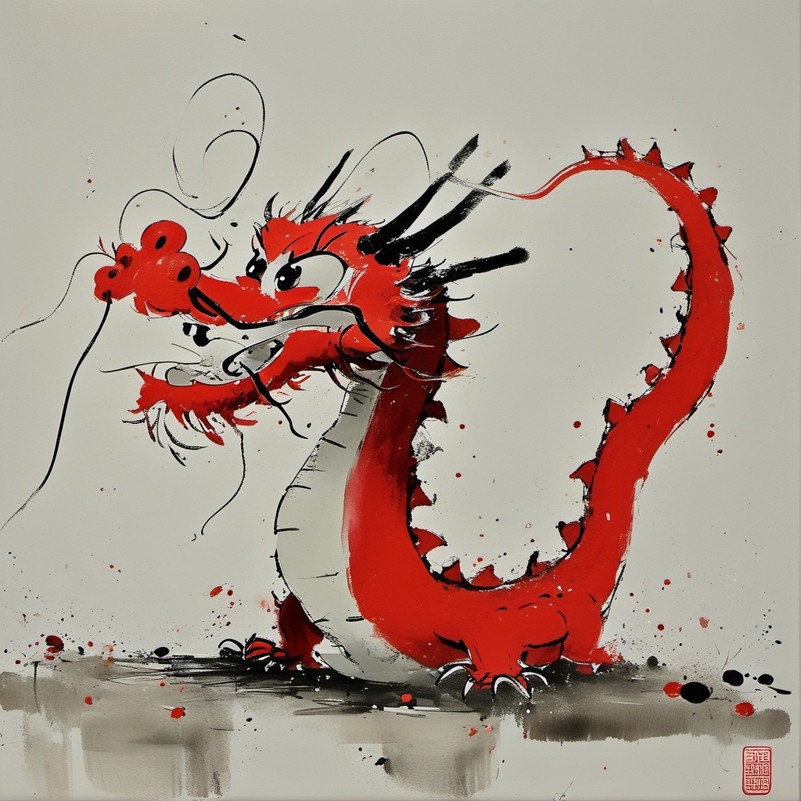
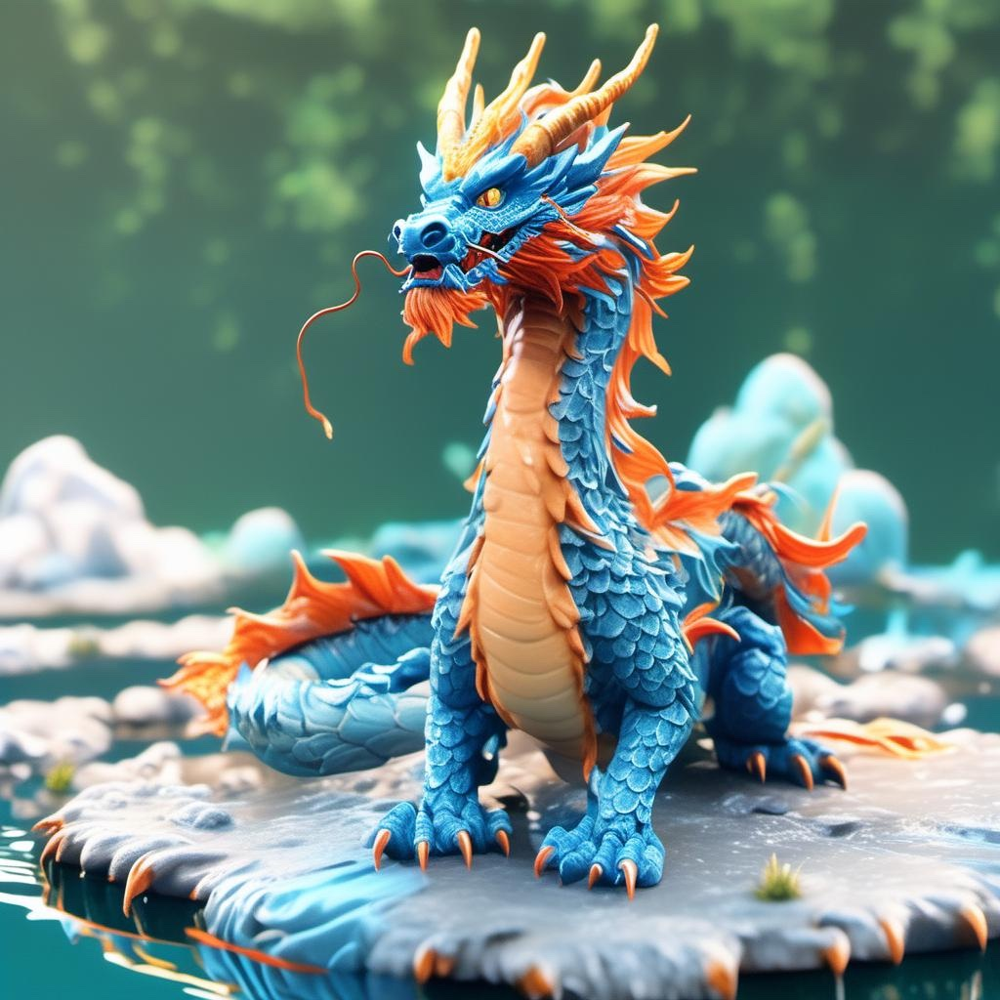
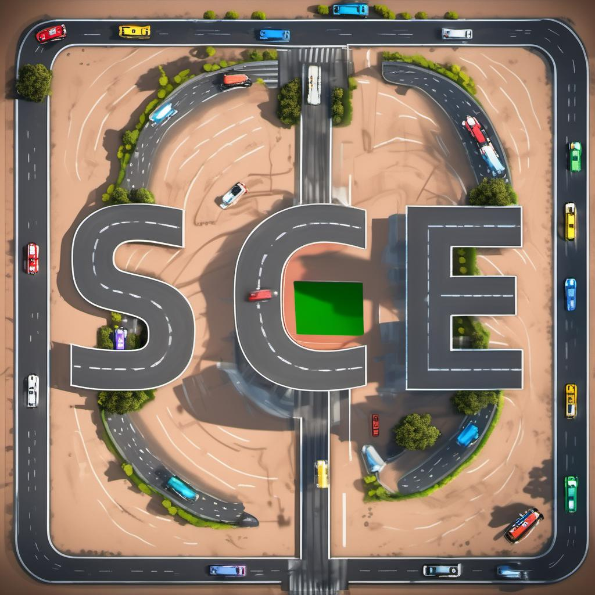
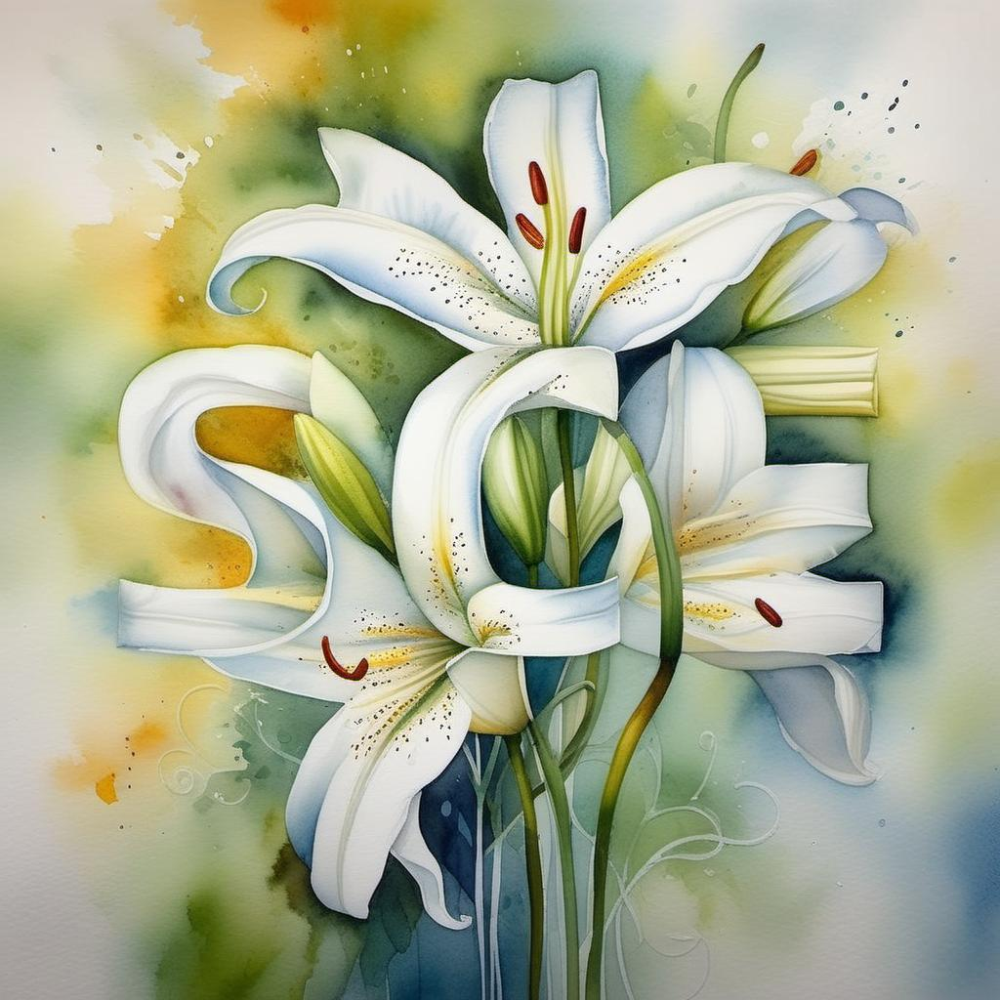

<p align="center">

  <h2 align="center">SCEdit: Efficient and Controllable Image Diffusion Generation via Skip Connection Editing</h2>
  <h3 align="center">(CVPR 2024 Highlight)</h3>
  <p align="center">
    <strong>Zeyinzi Jiang</strong>
    ·
    <strong>Chaojie Mao</strong>
    ·
    <strong>Yulin Pan</strong>
    ·
    <strong>Zhen Han</strong>
    ·
    <strong>Jingfeng Zhang</strong>
    <br>
    <b>Alibaba Group</b>
    <br>
        <a href="https://arxiv.org/abs/2312.11392"></a>
        <a href='https://scedit.github.io/'></a>
        <a href='https://github.com/modelscope/scepter'></a>
        <a href='https://github.com/modelscope/swift'></a>
    <br>
  </p>
  
SCEdit is an efficient generative fine-tuning framework proposed by Alibaba TongYi Vision Intelligence Lab. This framework enhances the fine-tuning capabilities for text-to-image generation downstream tasks and enables quick adaptation to specific generative scenarios, **saving 30%-50% of training memory costs compared to LoRA**. Furthermore, it can be directly extended to controllable image generation tasks, **requiring only 7.9% of the parameters that ControlNet needs for conditional generation and saving 30% of memory usage**. It supports various conditional generation tasks including edge maps, depth maps, segmentation maps, poses, color maps, and image completion.

## Usage

### Text-to-Image Generation
```shell
# SD v1.5
python scepter/tools/run_train.py --cfg scepter/methods/scedit/t2i/sd15_512_sce_t2i.yaml
# SD v2.1
python scepter/tools/run_train.py --cfg scepter/methods/scedit/t2i/sd21_768_sce_t2i.yaml
# SD XL
python scepter/tools/run_train.py --cfg scepter/methods/scedit/t2i/sdxl_1024_sce_t2i.yaml
```

### Controllable Image Synthesis
```shell
# SD v1.5 + hed
python scepter/tools/run_train.py --cfg scepter/methods/scedit/ctr/sd15_512_sce_ctr_hed.yaml
# SD v2.1 + canny
python scepter/tools/run_train.py --cfg scepter/methods/scedit/ctr/sd21_768_sce_ctr_canny.yaml
# SD XL + depth
python scepter/tools/run_train.py --cfg scepter/methods/scedit/ctr/sdxl_1024_sce_ctr_depth.yaml
```

### Gradio
```shell
python -m scepter.tools.webui  # Then click [Use Tuners] or [Use Controller] 
```

## Models

### Model URL

| Model  | URL                                                                                                                                       |
|--------|-------------------------------------------------------------------------------------------------------------------------------------------|
| SCEdit | [ModelScope](https://modelscope.cn/models/iic/scepter_scedit/summary) [HuggingFace](https://huggingface.co/scepter-studio/scepter_scedit) |

### Text-to-Image Generation

| **Model** | **SCEdit** |
|:---------:|:----------:|
|   SD 1.5  |      🪄     |
|   SD 2.1  |      🪄     |
|   SD XL   |      🪄     |

### Controllable Image Synthesis

| **Model** | **Canny** | **HED** | **Depth** | **Pose** | **Color** |
|:---------:|:---------:|:-------:|:---------:|:--------:|:---------:|
|   SD 2.1  |     🪄     |    🪄    |     🪄     |     🪄    |     🪄     |
|   SD XL   |     🪄     |    🪄    |     🪄     |     🪄    |     🪄     |


## Application Gallery 

### Dragon Year Special: Dragon Tuner

<table>
  <tr>
    <td><strong>Gold Dragon Tuner</strong></td>
    <td><strong>Sloppy Dragon Tuner</strong></td>
    <td><strong>Red Dragon Tuner</strong><br> + Papercraft Mantra</td>
    <td><strong>Azure Dragon Tuner</strong><br> + Pose Control</td>
  </tr>
  <tr>
    <td></td>
    <td></td>
    <td></td>
    <td></td>
  </tr>
</table>

### Text Effect Image

<table>
  <tr>
    <td><strong>Conditional Image</strong></td>
    <td><strong>Midas Control</strong><br>"Race track, top view"</td>
    <td><strong>Midas Control</strong><br> + Watercolor Mantra<br>"white lilies"</td>
    <td><strong>Midas Control</strong><br> + Dragon Tuner<br>"Spring Festival, Chinese dragon"</td>
  </tr>
  <tr>
    <td></td>
    <td></td>
    <td></td>
    <td></td>
  </tr>
</table>


## BibTeX

```bibtex
@article{jiang2023scedit,
    title = {SCEdit: Efficient and Controllable Image Diffusion Generation via Skip Connection Editing},
    author = {Jiang, Zeyinzi and Mao, Chaojie and Pan, Yulin and Han, Zhen and Zhang, Jingfeng},
    year = {2023},
    journal = {arXiv preprint arXiv:2312.11392}  
}
```


