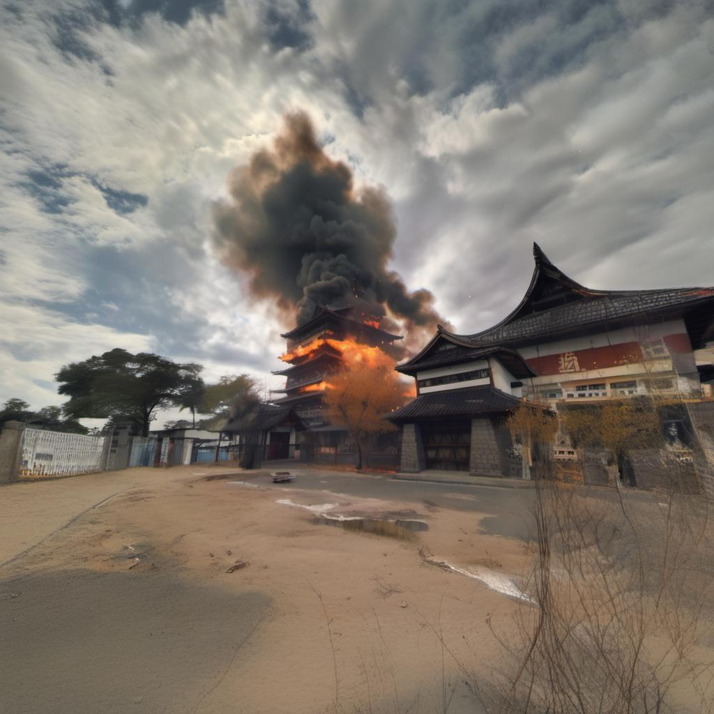
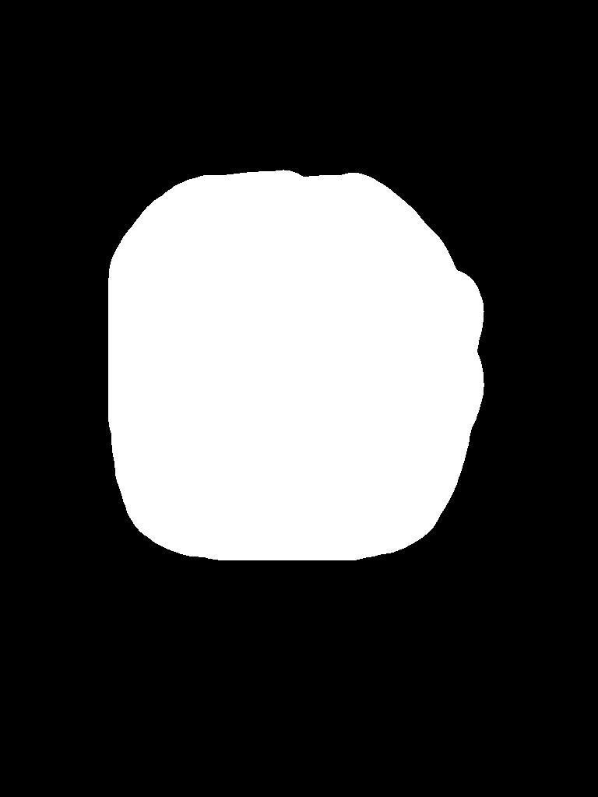
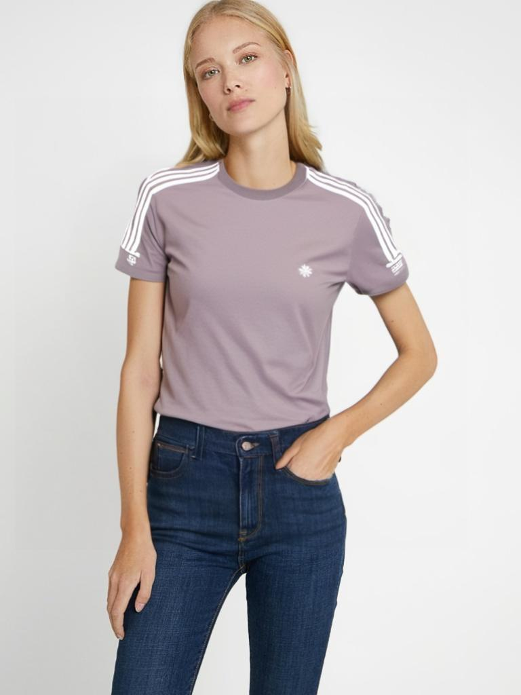
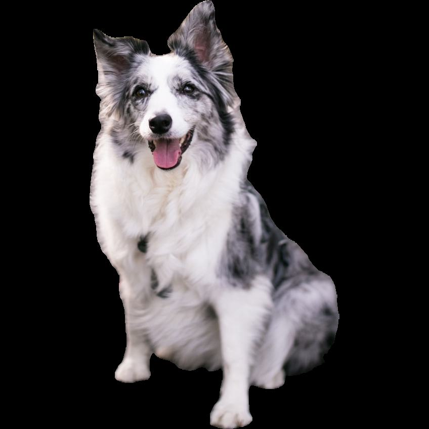
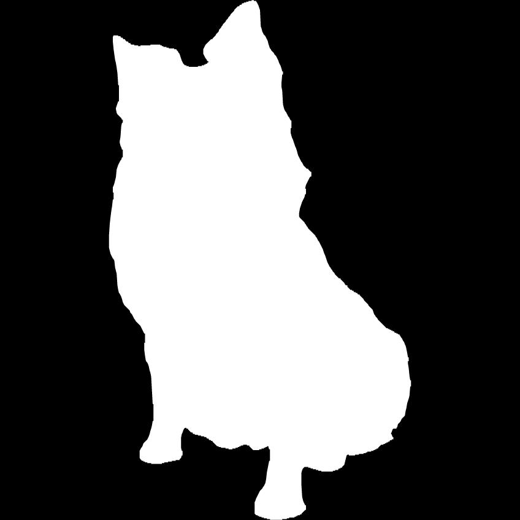

<h1 align="center">🪄SCEPTER</h1>

<p align="center">


<a href="https://pypi.org/project/scepter/"></a>
<a href="https://github.com/modelscope/scepter/blob/main/LICENSE"></a>
<a href="https://github.com/modelscope/scepter/"></a>
</p>

## 📖 Table of Contents
- [News](#-news)
- [Introduction](#-introduction)
- [Installation](#%EF%B8%8F-installation)
- [Getting Started](#-getting-started)
- [SCEPTER Studio](#%EF%B8%8F-scepter-studio)
- [Gallery](#%EF%B8%8F-gallery)
- [Features](#-features)
- [Learn More](#-learn-more)
- [License](#license)
- [Acknowledgement](#acknowledgement)

## 🎉 News
- [2024.03]: We optimize the training UI and checkpoint management. New [LAR-Gen](https://arxiv.org/abs/2403.19534) model has been added on SCEPTER Studio, supporting `zoom-out`, `virtual try on`, `inpainting`.
- [2024.02]: We release new SCEdit controllable image synthesis models for SD v2.1 and SD XL. Multiple strategies applied to accelerate inference time for SCEPTER Studio.
- [2024.01]: We release **SCEPTER Studio**, an integrated toolkit for data management, model training and inference based on [Gradio](https://www.gradio.app/).
- [2024.01]: [SCEdit](https://arxiv.org/abs/2312.11392) support controllable image synthesis for training and inference.
- [2023.12]: We propose [SCEdit](https://arxiv.org/abs/2312.11392), an efficient and controllable generation framework.
- [2023.12]: We release [🪄SCEPTER](https://github.com/modelscope/scepter/) library.

## 📝 Introduction

SCEPTER is an open-source code repository dedicated to generative training, fine-tuning, and inference, encompassing a suite of downstream tasks such as image generation, transfer, editing. It integrates popular community-driven implementations as well as proprietary methods by Tongyi Lab of Alibaba Group, offering a comprehensive toolkit for researchers and practitioners in the field of AIGC. This versatile library is designed to facilitate innovation and accelerate development in the rapidly evolving domain of generative models.

Main Feature:

- Task:
  - Text-to-image generation
  - Controllable image synthesis
  - Image editing
- Training / Inference:
  - Distribute: DDP / FSDP / FairScale / Xformers
  - File system: Local / Http / OSS / Modelscope
- Deploy:
  - Data management
  - Training
  - Inference

Currently supported approaches (and counting):

1. SD Series: [Stable Diffusion v1.5](https://huggingface.co/runwayml/stable-diffusion-v1-5) / [Stable Diffusion v2.1](https://huggingface.co/runwayml/stable-diffusion-v1-5) / [Stable Diffusion XL](https://huggingface.co/stabilityai/stable-diffusion-xl-base-1.0)
2. SCEdit(CVPR2024): [SCEdit: Efficient and Controllable Image Diffusion Generation via Skip Connection Editing](https://arxiv.org/abs/2312.11392)  [](https://arxiv.org/abs/2312.11392) [](https://scedit.github.io/)
3. Res-Tuning(NeurIPS2023 TODO): [Res-Tuning: A Flexible and Efficient Tuning Paradigm via Unbinding Tuner from Backbone](https://arxiv.org/abs/2310.19859) [](https://arxiv.org/abs/2310.19859) [](https://res-tuning.github.io/)
4. LAR-Gen: [Locate, Assign, Refine: Taming Customized Image Inpainting with Text-Subject Guidance](https://arxiv.org/abs/2403.19534)  [](https://arxiv.org/abs/2403.19534) [](https://ali-vilab.github.io/largen-page/)

## 🛠️ Installation

- Create new environment

```shell
conda env create -f environment.yaml
conda activate scepter
```
- We recommend installing the specific version of PyTorch and accelerate toolbox [xFormers](https://pypi.org/project/xformers/). You can install these recommended version by pip:

```shell
pip install -r requirements/recommended.txt
```

- Install SCEPTER by the `pip` command:

```shell
pip install scepter
```

## 🚀 Getting Started

### Dataset

#### Modelscope Format

We use a [custom-stylized dataset](https://modelscope.cn/datasets/damo/style_custom_dataset/summary), which included classes 3D, anime, flat illustration, oil painting, sketch, and watercolor, each with 30 image-text pairs.

```python
# pip install modelscope
from modelscope.msdatasets import MsDataset
ms_train_dataset = MsDataset.load('style_custom_dataset', namespace='damo', subset_name='3D', split='train_short')
print(next(iter(ms_train_dataset)))
```

#### CSV Format

For the data format used by SCEPTER Studio, please refer to [3D_example_csv.zip](https://modelscope.cn/api/v1/models/damo/scepter/repo?Revision=master&FilePath=datasets/3D_example_csv.zip).

#### TXT Format

To facilitate starting training in command-line mode, you can use a dataset in text format, please refer to [3D_example_txt.zip](https://modelscope.cn/api/v1/models/damo/scepter/repo?Revision=master&FilePath=datasets/3D_example_txt.zip)

```shell
mkdir -p cache/datasets/ && wget 'https://modelscope.cn/api/v1/models/damo/scepter_scedit/repo?Revision=master&FilePath=dataset/3D_example_txt.zip' -O cache/datasets/3D_example_txt.zip && unzip cache/datasets/3D_example_txt.zip -d cache/datasets/ && rm cache/datasets/3D_example_txt.zip
```

### Training

We provide a framework for training and inference, so the script below is just for illustration purposes. To achieve better results, you can modify the corresponding parameters as needed.

#### Text-to-Image Generation

- SCEdit
```python
python scepter/tools/run_train.py --cfg scepter/methods/scedit/t2i/sd15_512_sce_t2i.yaml  # SD v1.5
python scepter/tools/run_train.py --cfg scepter/methods/scedit/t2i/sd21_768_sce_t2i.yaml  # SD v2.1
python scepter/tools/run_train.py --cfg scepter/methods/scedit/t2i/sdxl_1024_sce_t2i.yaml  # SD XL
```

- Existing Tuning Strategies
```python
python scepter/tools/run_train.py --cfg scepter/methods/examples/generation/stable_diffusion_1.5_512.yaml  # fully-tuning on SD v1.5
python scepter/tools/run_train.py --cfg scepter/methods/examples/generation/stable_diffusion_2.1_768_lora.yaml  # lora-tuning on SD v2.1
```

- Data Text Format
```python
# Download the 3D_example_txt.zip as previously mentioned
python scepter/tools/run_train.py --cfg scepter/methods/scedit/t2i/sdxl_1024_sce_t2i_datatxt.yaml
```

#### Controllable Image Synthesis

- SCEdit

The YAML configuration can be modified to combine different base models and conditions. The following is provided as an example.
```python
python scepter/tools/run_train.py --cfg scepter/methods/scedit/ctr/sd15_512_sce_ctr_hed.yaml  # SD v1.5 + hed
python scepter/tools/run_train.py --cfg scepter/methods/scedit/ctr/sd21_768_sce_ctr_canny.yaml  # SD v2.1 + canny
python scepter/tools/run_train.py --cfg scepter/methods/scedit/ctr/sd21_768_sce_ctr_pose.yaml  # SD v2.1 + pose
python scepter/tools/run_train.py --cfg scepter/methods/scedit/ctr/sdxl_1024_sce_ctr_depth.yaml  # SD XL + depth
python scepter/tools/run_train.py --cfg scepter/methods/scedit/ctr/sdxl_1024_sce_ctr_color.yaml  # SD XL + color
```

- Data Text Format
```python
# Download the 3D_example_txt.zip as previously mentioned
python scepter/tools/run_train.py --cfg scepter/methods/scedit/ctr/sdxl_1024_sce_ctr_color_datatxt.yaml
```

### Inference

#### Base Model Inference

```python
python scepter/tools/run_inference.py --cfg scepter/methods/examples/generation/stable_diffusion_1.5_512.yaml --prompt 'a cute dog' --save_folder 'inference'  # generation on SD v1.5
python scepter/tools/run_inference.py --cfg scepter/methods/examples/generation/stable_diffusion_2.1_768.yaml --prompt 'a cute dog' --save_folder 'inference'  # generation on SD v2.1
python scepter/tools/run_inference.py --cfg scepter/methods/examples/generation/stable_diffusion_xl_1024.yaml --prompt 'a cute dog' --save_folder 'inference'  # generation on SD XL
```

#### Fine-tuned Model Inference

```python
python scepter/tools/run_inference.py --cfg scepter/methods/scedit/t2i/sd15_512_sce_t2i_swift.yaml --pretrained_model 'cache/save_data/sd15_512_sce_t2i_swift/checkpoints/ldm_step-100.pth' --prompt 'A close up of a small rabbit wearing a hat and scarf' --save_folder 'trained_test_prompt_rabbit'
```

#### Controllable Image Synthesis Inference

- SCEdit
```python
python scepter/tools/run_inference.py --cfg scepter/methods/scedit/ctr/sd21_768_sce_ctr_canny.yaml --num_samples 1 --prompt 'a single flower is shown in front of a tree' --save_folder 'test_flower_canny' --image_size 768 --task control --image 'asset/images/flower.jpg' --control_mode canny --pretrained_model ms://damo/scepter_scedit@controllable_model/SD2.1/canny_control/0_SwiftSCETuning/pytorch_model.bin   # canny
python scepter/tools/run_inference.py --cfg scepter/methods/scedit/ctr/sd21_768_sce_ctr_pose.yaml --num_samples 1 --prompt 'super mario' --save_folder 'test_mario_pose' --image_size 768 --task control --image 'asset/images/pose_source.png' --control_mode source --pretrained_model ms://damo/scepter_scedit@controllable_model/SD2.1/pose_control/0_SwiftSCETuning/pytorch_model.bin   # pose
```

### Customize Modules
Refer to `example`, build the modules of your task in `example/{task}`.
```python
cd example/classifier
python run.py --cfg classifier.yaml
```


## 🖥️ SCEPTER Studio

### Launch

To fully experience **SCEPTER Studio**, you can launch the following command line:

```shell
pip install scepter
python -m scepter.tools.webui
```
or run after clone repo code
```shell
git clone https://github.com/modelscope/scepter.git
PYTHONPATH=. python scepter/tools/webui.py --cfg scepter/methods/studio/scepter_ui.yaml
```

The startup of **SCEPTER Studio** eliminates the need for manual downloading and organizing of models; it will automatically load the corresponding models and store them in a local directory.
Depending on the network and hardware situation, the initial startup usually requires 15-60 minutes, primarily involving the download and processing of SDv1.5, SDv2.1, and SDXL models.
Therefore, subsequent startups will become much faster (about one minute) as downloading is no longer required.

* LAR-Gen: we release `zoom-out`, `virtual try on`, `inpainting(text guided)`, `inpainting(text + reference image guided)` image editing capabilities.
Please note that the **Data Preprocess** button must be clicked before clicking the **Generate** button.
<p align="center">

</p>

### Modelscope Studio

We deploy a work studio on Modelscope that includes only the inference tab, please refer to [ms_scepter_studio](https://www.modelscope.cn/studios/damo/scepter_studio/summary)

## 🖼️ Gallery

### LAR-Gen: Zoom Out
<table>
  <tr>
    <td><strong>Origin Image</strong><br>Prompt: a temple on fire</td>
    <td><strong>Zoom-Out</strong><br>CenterAround:0.75</td>
    <td><strong>Zoom-Out</strong><br>CenterAround:0.75</td>
    <td><strong>Zoom-Out</strong><br>CenterAround:0.75</td>
    <td><strong>Zoom-Out</strong><br>CenterAround:0.75</td>
  </tr>
  <tr>
    <td></td>
    <td></td>
    <td></td>
    <td></td>
    <td></td>
  </tr>
</table>

### LAR-Gen: Virtual Try-on
<table>
  <tr>
    <td><strong>Model Image</strong></td>
    <td><strong>Model Mask</strong></td>
    <td><strong>Clothing Image</strong></td>
    <td><strong>Clothing Mask</strong></td>
    <td><strong>Try-on Output</strong></td>
  </tr>
  <tr>
    <td></td>
    <td></td>
    <td></td>
    <td></td>
    <td></td>
  </tr>
</table>

### LAR-Gen: Inpainting (Text guided)
<table>
  <tr>
    <td><strong>Origin Image</strong><br>Prompt: a blue and white porcelain</td>
    <td><strong>Inpainting Mask1</strong></td>
    <td><strong>Inpainting Output1</strong></td>
    <td><strong>Inpainting Mask2</strong><br>Prompt: a clock</td>
    <td><strong>Inpainting Output2</strong></td>
  </tr>
  <tr>
    <td></td>
    <td></td>
    <td></td>
    <td></td>
    <td></td>
  </tr>
</table>

### LAR-Gen: Inpainting (Text and Subject guided)
<table>
  <tr>
    <td><strong>Origin Image</strong><br>Prompt: a dog wearing sunglasses</td>
    <td><strong>Origin Mask</strong></td>
    <td><strong>Reference Image</strong></td>
    <td><strong>Reference Mask</strong></td>
    <td><strong>Inpainting Output</strong></td>
  </tr>
  <tr>
    <td></td>
    <td></td>
    <td></td>
    <td></td>
    <td></td>
  </tr>
</table>

### Dragon Year Special: Dragon Tuner

<table>
  <tr>
    <td><strong>Gold Dragon Tuner</strong></td>
    <td><strong>Sloppy Dragon Tuner</strong></td>
    <td><strong>Red Dragon Tuner</strong><br> + Papercraft Mantra</td>
    <td><strong>Azure Dragon Tuner</strong><br> + Pose Control</td>
  </tr>
  <tr>
    <td></td>
    <td></td>
    <td></td>
    <td></td>
  </tr>
</table>

### Text Effect Image

<table>
  <tr>
    <td><strong>Conditional Image</strong></td>
    <td><strong>Midas Control</strong><br>"Race track, top view"</td>
    <td><strong>Midas Control</strong><br> + Watercolor Mantra<br>"white lilies"</td>
    <td><strong>Midas Control</strong><br> + Dragon Tuner<br>"Spring Festival, Chinese dragon"</td>
  </tr>
  <tr>
    <td></td>
    <td></td>
    <td></td>
    <td></td>
  </tr>
</table>

## ✨ Features

### Text-to-Image Generation

| **Model** | **SCEdit** | **Full** | **LoRA** |
|:---------:|:----------:|:--------:|:--------:|
|   SD 1.5  |      🪄     |     ✅    |     ✅    |
|   SD 2.1  |      🪄     |     ✅    |     ✅    |
|   SD XL   |      🪄     |     ✅    |     ✅    |

### Controllable Image Synthesis
- SCEdit

| **Model** | **Canny** | **HED** | **Depth** | **Pose** | **Color** |
|:---------:|:---------:|:-------:|:---------:|:--------:|:---------:|
|   SD 1.5  |     ✅     |    ✅    |     ✅     |     ✅    |     ✅     |
|   SD 2.1  |     🪄     |    🪄    |     🪄     |     🪄    |     🪄     |
|   SD XL   |     🪄     |    🪄    |     🪄     |     🪄    |     🪄     |

### Image Editing
- LAR-Gen

| **Model** | **Locate** | **Assign** | **Refine** |
|:---------:|:----------:|:----------:|:----------:|
|   SD XL   |     🪄     |    🪄       |     ⏳     |

### Model URL

- ✅ indicates support for both training and inference.
- 🪄 denotes that the model has been published.
- ⏳ denotes that the module has not been integrated currently.
- More models will be released in the future.

| Model  | URL                                                                                                                                            |
|--------|------------------------------------------------------------------------------------------------------------------------------------------------|
| SCEdit | [ModelScope](https://modelscope.cn/models/iic/scepter_scedit/summary) [HuggingFace](https://huggingface.co/scepter-studio/scepter_scedit) |
| LAR-Gen | [ModelScope](https://www.modelscope.cn/models/iic/LARGEN/summary) |

PS: Scripts running within the SCEPTER framework will automatically fetch and load models based on the required dependency files, eliminating the need for manual downloads.


## 🔍 Learn More

- [Alibaba TongYi Vision Intelligence Lab](https://github.com/ali-vilab)

  Discover more about open-source projects on image generation, video generation, and editing tasks.

- [ModelScope library](https://github.com/modelscope/modelscope/)

  ModelScope Library is the model library of ModelScope project, which contains a large number of popular models.

- [SWIFT library](https://github.com/modelscope/swift/)

  SWIFT (Scalable lightWeight Infrastructure for Fine-Tuning) is an extensible framwork designed to faciliate lightweight model fine-tuning and inference.

## BibTeX
If our work is useful for your research, please consider citing:
```bibtex
@misc{scepter,
    title = {SCEPTER, https://github.com/modelscope/scepter},
    author = {SCEPTER},
    year = {2023}
}
```


## License

This project is licensed under the [Apache License (Version 2.0)](https://github.com/modelscope/modelscope/blob/master/LICENSE).

## Acknowledgement
Thanks to [Stability-AI](https://github.com/Stability-AI), [SWIFT library](https://github.com/modelscope/swift/) and [Fooocus](https://github.com/lllyasviel/Fooocus) for their awesome work.
